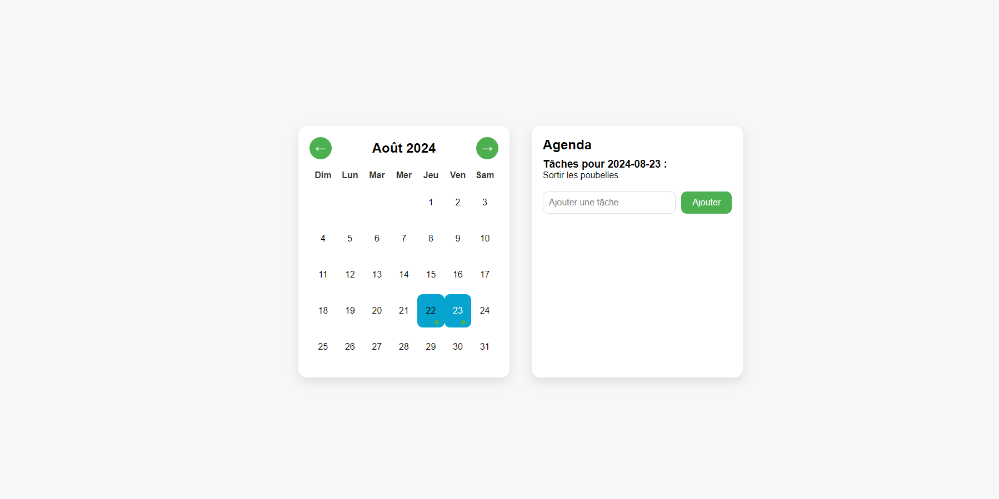

# 🗓️ Projet Agenda Web - Calendrier Interactif

Ce projet est une application web simple et moderne qui permet aux utilisateurs de gérer leurs tâches quotidiennes à l'aide d'un calendrier interactif. Les utilisateurs peuvent ajouter des tâches pour une date donnée, les stocker dans une base de données MySQL, et visualiser les tâches planifiées pour chaque jour.

## 🌟 Contexte du Projet

Ce projet a été conçu dans le but d'apprendre et de pratiquer le développement web full-stack en utilisant des technologies telles que **HTML**, **CSS**, **JavaScript**, **PHP**, et **MySQL**. Il simule une petite application de gestion d'agenda où les utilisateurs peuvent :

1. 🗓️ Naviguer dans un calendrier pour voir les jours et les mois.
2. ✍️ Ajouter des tâches à des dates spécifiques.
3. 🔔 Voir les jours où des tâches sont planifiées grâce à des indicateurs visuels.
4. 💾 Stocker ces tâches dans une base de données MySQL.

## ✨ Fonctionnalités

- **Affichage du calendrier mensuel** : Un calendrier interactif qui affiche le mois actuel, avec la possibilité de naviguer vers les mois précédents et suivants.
- **Ajout de tâches** : L'utilisateur peut sélectionner une date dans le calendrier et ajouter des tâches associées à cette date.
- **Indicateur de tâches** : Les jours avec des tâches enregistrées sont visuellement identifiés dans le calendrier.
- **Stockage en base de données** : Les tâches sont sauvegardées dans une base de données MySQL via des scripts PHP.
- **Affichage des tâches** : L'utilisateur peut voir les tâches planifiées pour une date spécifique.

## 🛠️ Technologies Utilisées

- **Frontend** : HTML, CSS, JavaScript
- **Backend** : PHP
- **Base de données** : MySQL
- **Autres outils** : phpMyAdmin (pour la gestion de la base de données)

## 🚀 Installation et Configuration

### Prérequis

- Un serveur web local avec PHP (par exemple XAMPP, MAMP, ou WAMP).
- MySQL installé et configuré.
- phpMyAdmin (facultatif) pour gérer la base de données via une interface graphique.

### Commande pour la création de la base de données 

1.CREATE DATABASE calendrier_db;

USE calendrier_db;

CREATE TABLE tasks (
    id INT AUTO_INCREMENT PRIMARY KEY,
    task_date DATE NOT NULL,
    task_text TEXT NOT NULL
);

## Captures d'écran

### Affichage du Calendrier

